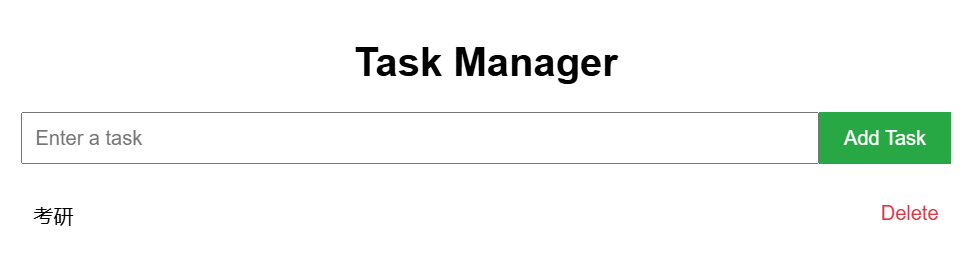

# run_detox

* 使用 FastAPI 提供了更高的性能和现代化的开发体验。
* 通过 SQLAlchemy 操作 SQLite 数据库。
* 使用 Jinja2 模板引擎渲染 HTML 页面。
* 通过 `uvicorn` 运行应用，支持热重载（`--reload` 参数）

  需要安装的依赖主要有fastapi   uvicorn   sqlalchemy    jinja2

  运行：uvicorn main:app --reload

  访问 `http://127.0.0.1:8000/` 即可使用任务管理系统

  多次运行会由于抢占而冲突需删除
* sudo lsof -i :8000
* sudo kill -9 `<PID>`

